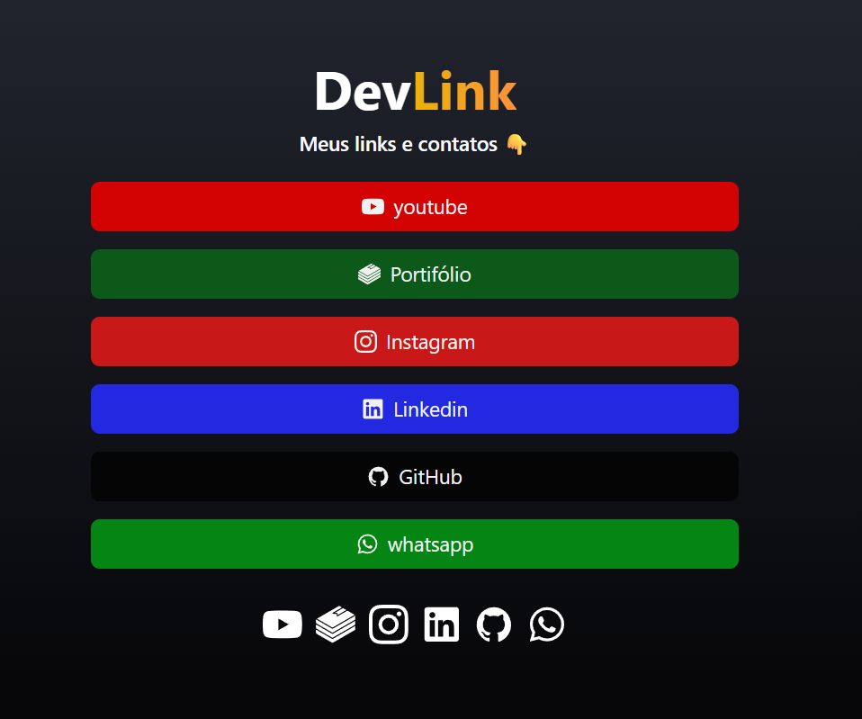
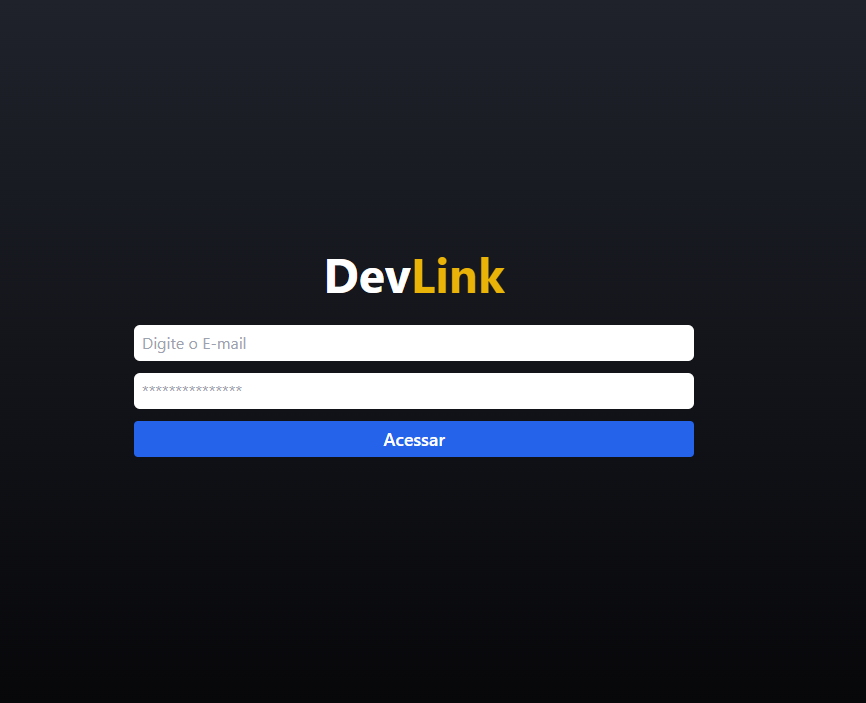

# DevLink

Aplicação web inspirada no Linktree para centralizar links profissionais em uma página pública, com painel administrativo protegido para gerenciamento.

## Demo

- Produção (Vercel): https://linktree-eosin-one.vercel.app/

## O Que Este Projeto Demonstra

O DevLink resolve um problema comum de presença digital: reunir portfólio, redes sociais e canais de contato em um único link compartilhável.

Este projeto demonstra:
- Construção de interface SPA com React + TypeScript.
- Integração real com Firebase Authentication e Cloud Firestore.
- Organização de rotas públicas e privadas com proteção de acesso.
- Modelagem de dados simples e escalável para CRUD de links.
- Experiência de usuário com feedback visual e identificação automática de tipo de link.

## Principais funcionalidades

- Página pública com listagem de links cadastrados.
- Painel admin para criar, visualizar e remover links.
- Personalização visual dos links (cor de fundo e cor do texto).
- Geração automática de ícones sociais a partir da URL/nome do link.
- Login com autenticação via Firebase.

## Stack utilizada

- `React 19`
- `TypeScript`
- `Vite`
- `React Router DOM`
- `Firebase Auth`
- `Firebase Firestore`
- `Tailwind CSS`
- `React Icons`
- `ESLint`

## Rotas da aplicação

- `/` - Home pública com links e ícones.
- `/login` - Tela de autenticação.
- `/admin` - Área administrativa protegida.

## Screenshots

### Home (visualização pública)
Exibe os links já cadastrados e os ícones das redes sociais para facilitar o acesso rápido dos visitantes.



### Cadastro de links (área administrativa)
Tela onde a pessoa logada cadastra links e personaliza cor do botão e cor do texto para montar sua vitrine.


### Login (acesso protegido)
Tela de autenticação. Somente usuários logados conseguem acessar a área administrativa e realizar alterações.



## Arquitetura resumida

- Frontend em SPA com React e roteamento no cliente.
- Persistência dos links em `Firestore` (coleção `links`).
- Controle de acesso de páginas privadas por autenticação (`Firebase Auth`).
- Configuração segura de ambiente com variáveis `VITE_*`.

## Como rodar localmente

1. Instale dependências:
```bash
npm install
```

2. Configure as variáveis de ambiente com base no `.env.example`:
```env
VITE_FIREBASE_API_KEY=
VITE_FIREBASE_AUTH_DOMAIN=
VITE_FIREBASE_PROJECT_ID=
VITE_FIREBASE_STORAGE_BUCKET=
VITE_FIREBASE_MESSAGING_SENDER_ID=
VITE_FIREBASE_APP_ID=
```

3. Inicie em modo desenvolvimento:
```bash
npm run dev
```

4. Build de produção:
```bash
npm run build
```
